# **MindEase: Proactive Mental Health Companion**
An application to self identify the mental health status of a person and provide guidance for support.

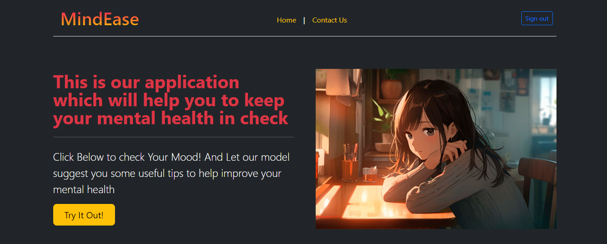
## Problems Identified:

- The current state of mental health care often involves barriers such as stigma, lack of awareness, and limited access to resources. 
- Many individuals may hesitate to seek help due to fear of judgment or may not have easy access to mental health services.

## Solution Proposed:

- The project aims to tackle these challenges by providing a user-friendly platform that can anonymously assess mental health status, offer personalized guidance, and connect users to relevant resources and support.

## Features:

- School and University Support: Educational institutions can integrate the app to provide mental health resources and support for students and staff. 
- Preventive Mental Health Screenings: The mental health platform is integrated into routine health screenings, offering preventive mental health assessments. 
- Telehealth Mental Health Consultations: The platform facilitates telehealth consultations with mental health professionals. User can securely connect with therapists, counselors, or psychiatrists for counseling sessions enhancing accessibility to mental health care. 
- Work-Life Balance: Users can assess and improve their work-life balance, with the app offering strategies and resources for managing stress and maintaining well-being.

## Screening Prediction - Model Training:

    Dataset used: survey.csv
    (combination of PHQ-9, GAD-7 datasets & other important constraints mainly targeting corporate employees).

- Step 1: Data Cleaning - Filling NA values & to drop age data out of range of 18-60.

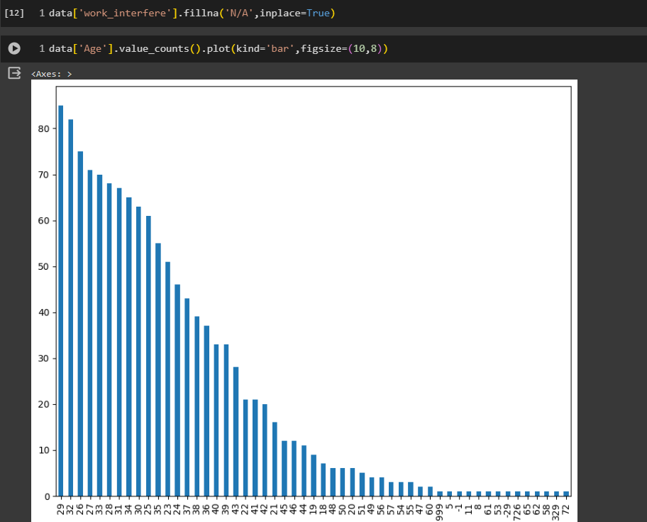

- Step 2: Neutralizing Data – Gender data with irregular entries gets neutralized to 3 standard entries.

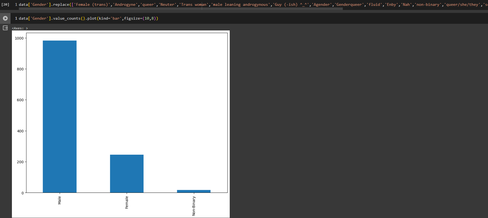

- Step 3: Data transformation – ColumnTransformer to transform data to a format.

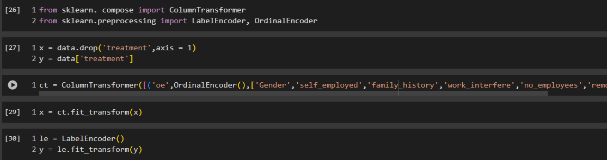

- Step 4: Choosing Algorithm – Using AdaBoost Algorithm, since it returns maximum accuracy.

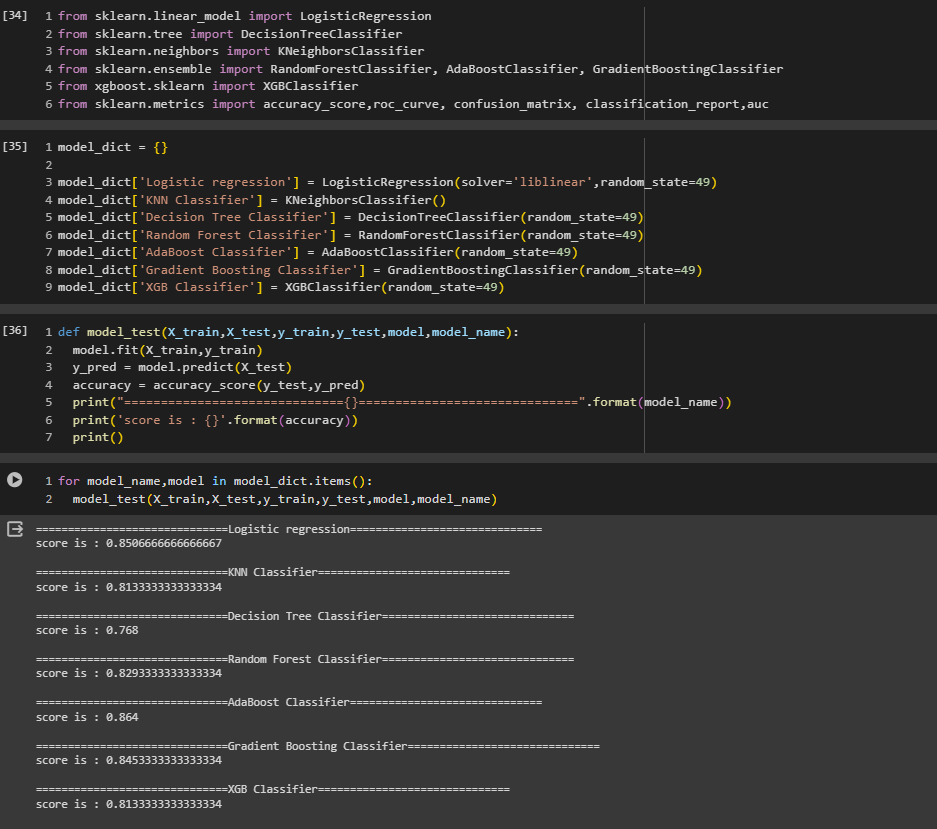

- Step 5: Search Technique – Using RandomizedSearchCV Search Technique.

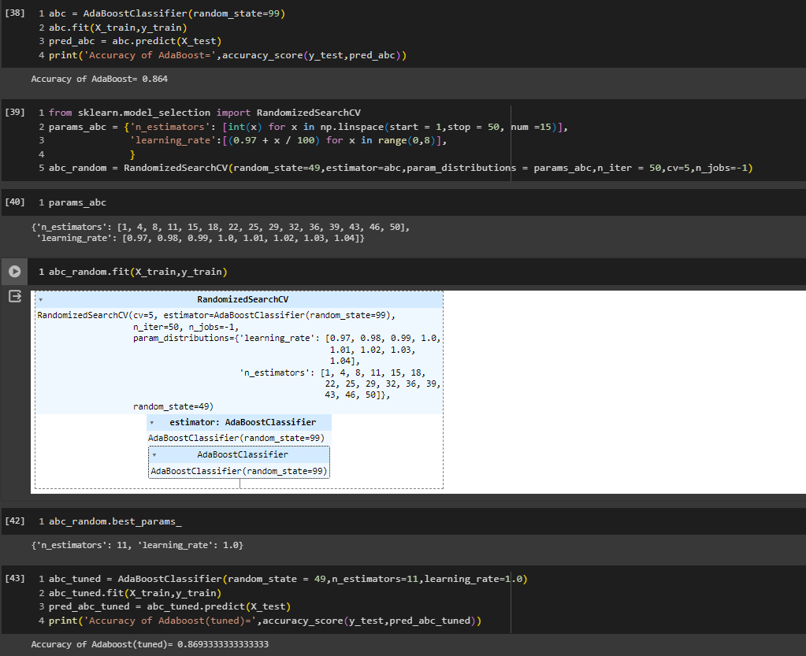

- Step 6: Confusion Matrix – Returning Type-1 & Type-2 Error.

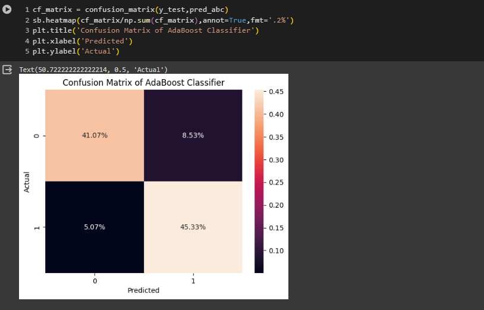

- Step 7: Plotting ROC curve.

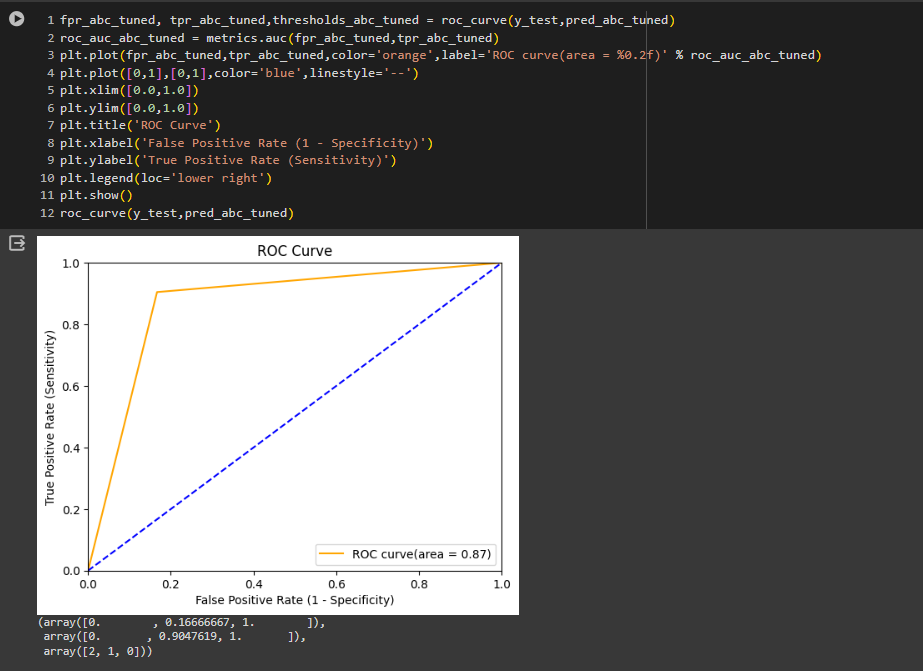

- Step 8: Serialization & Deserialization – Pickling abc_tuned model to model.pkl file(Byte System) & Returning screening score of some dataset entries using predict_proba function.

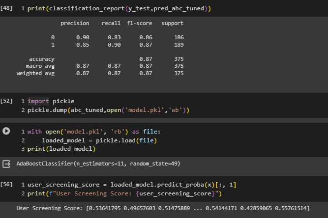

## Emotion detect:

    Algorithm used: HaarCascade.

- Loading the model.

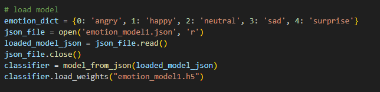

- Loading face and recognizing emotion with the help of algorithm.
- Adding a timeout to capture 30 fps for 5 seconds.

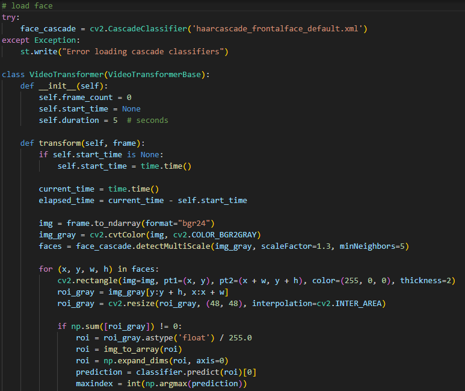
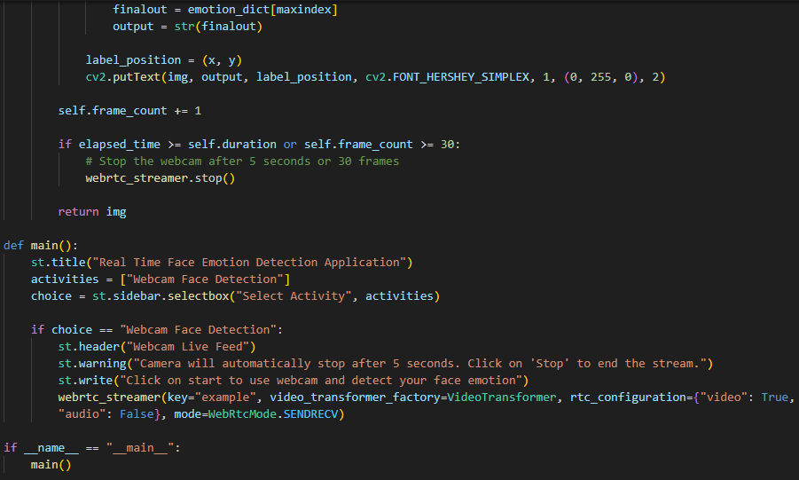

- Initial page for emotion recognition.

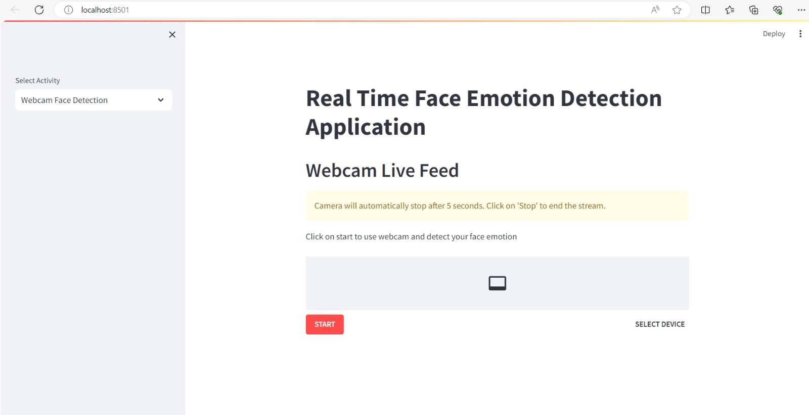

- Successfully identifying the emotions.

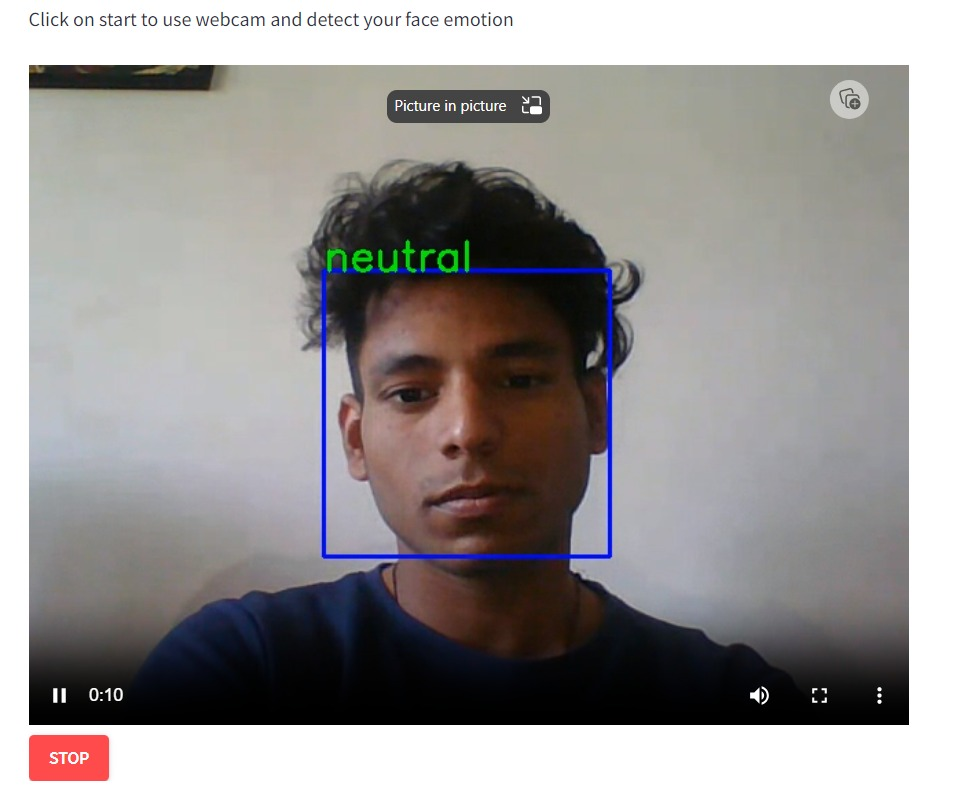
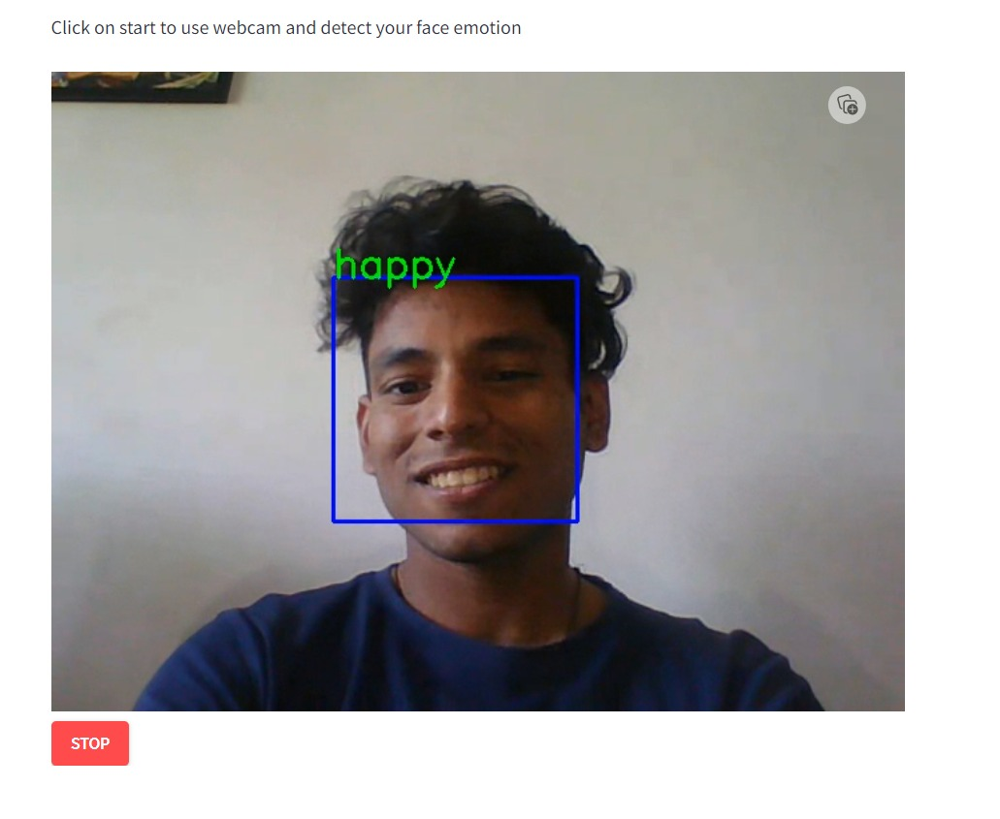

## List of Questions for Prediction:

- What is your age?
- Choose your gender.
- Are you self employed?
- Do you have a family history of mental illness? 
- If you have a mental health condition, do you feel that interferes with your work?
- How many employees does your company or organization have?
- Do you work remotely (outside of an office) at least 50% of the time?
- Is your employer primarily a tech company/organization?
- Does your employer provide mental health benefits?
- Do you know the options for mental health care your employer provides?
- Has your employer ever discussed mental health as part of an employee wellness program?
- Does your employer provide resources to learn more about mental health issues and how to seek help?
- Is your anonymity protected if you choose to take advantage of mental health or substance abuse treatment resources?
- How easy is it for you to take medical leave for a mental health condition?
- Do you think that discussing a mental health issue with your employer would have negative consequences?
- Do you think that discussing a physical health issue with your employer would have negative consequences?
- Would you be willing to discuss a mental health issue with your coworkers?
- Would you be willing to discuss a mental health issue with your direct supervisors?
- Would you bring up mental health issue with a potential employer in an interview?
- Would you bring up a physical health issue with a potential employer in an interview?
- Do you feel that your employer takes mental health as seriously as physical health?
- Have you heard of or observed negative consequences for coworkers with mental health conditions in your workplace?

## Our Team:

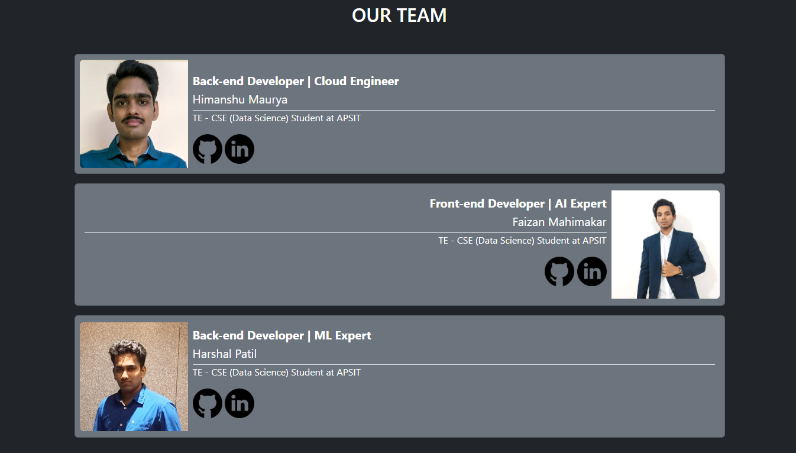

## Social links:

### GitHub:

- [Himanshu Maurya](https://github.com/himanshumaurya0007)
- [Faizan Mahimkar](https://github.com/Faizan-Mahimkar)
- [Harshal Patil](https://github.com/Harshal4511)

### LinkedIn:

- [Himanshu Maurya](https://www.linkedin.com/in/himanshumaurya0007)
- [Faizan Mahimkar](https://www.linkedin.com/in/faizan-mahimkar)
- [Harshal Patil](https://www.linkedin.com/in/harshal-patil4511)
